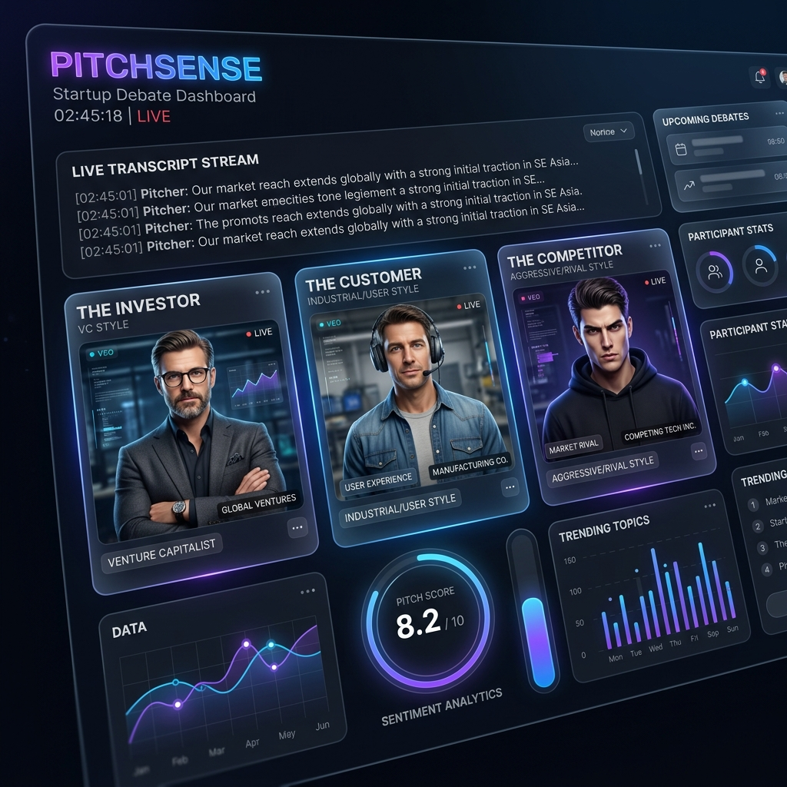
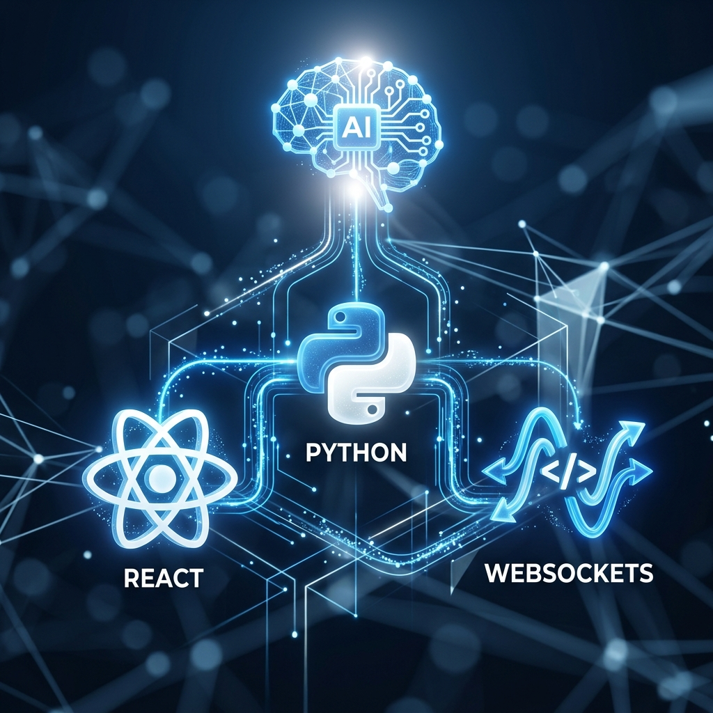
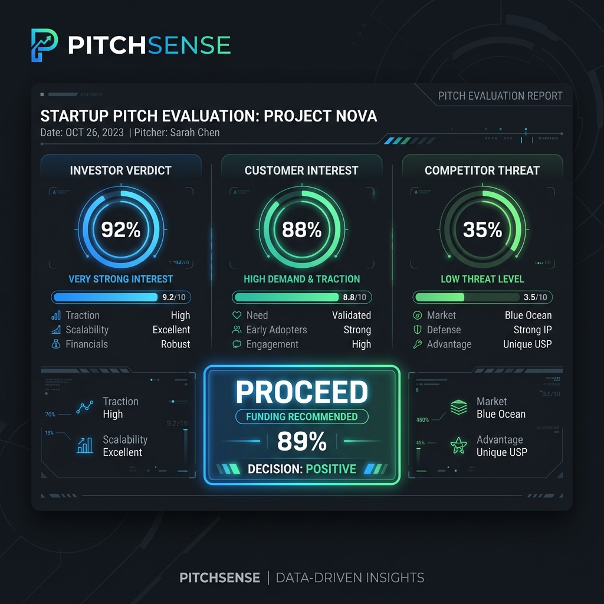

# PitchSense 🚀 — AI-Powered Startup Debate Arena



> **"Don't pitch to an empty room. Pitch to the critics who will actually matter."**

[](./LICENSE)
[](https://www.python.org/)
[](https://djangoproject.com/)
[](https://react.dev/)
[](https://groq.com/)

---

## 💡 Why I Built This

Every founder practices their pitch — but they practice with supportive friends, not adversarial investors. I noticed that the biggest reason startups fail at funding rounds isn't a bad idea; it's an untested idea. Founders never face hard questions until it's too late.

I built PitchSense to fix that. It simulates a high-stakes panel meeting with three AI personas who actively challenge your assumptions, contradict each other, and use live web data to punch holes in your pitch — before you walk into a real room. The goal was to build something that felt genuinely stressful and useful, not a toy chatbot.

---

## 🔥 Key Features

| Feature | Details |
|---|---|
| 🎙️ **Voice-First Input** | Speak your pitch hands-free via browser-native Speech Recognition |
| ⚡ **Ultra-Low Latency** | Token-streaming via Groq's LPU™ engine + Django Channels WebSockets |
| 🧠 **Shared Memory Model** | All three personas read each other's responses — they remember and double down |
| 🌐 **Live Market Intel** | Competitor persona fires real-time Tavily searches for actual rivals & funding rounds |
| 🔊 **Realistic Voice Synthesis** | Edge-TTS generates high-quality audio for every AI response |
| 📊 **Final Verdict** | 5-turn debate ends with a structured JSON scorecard: **KILL / PIVOT / PROCEED** |

---

## 🎭 The Panel

| Persona | Role | Specialty |
|---|---|---|
| **Ava Chen** | *The Investor* | Attacks unit economics, TAM/SAM, and execution moats |
| **Rohan Mehta** | *The Customer* | Focuses on switching costs, friction, and daily user pain |
| **Sara Lin** | *The Competitor* | Uses live web search to dismantle your unique edge |

---

## 🛠️ Tech Stack



| Layer | Technology |
|---|---|
| **Frontend** | React 19 + Vite + Tailwind CSS v4 |
| **Backend** | Django 4.2 + Django Channels (ASGI) |
| **Real-time** | WebSockets via Daphne |
| **LLM Engine** | Groq API (Llama 3 / Mixtral) |
| **Web Search** | Tavily API |
| **TTS** | Microsoft Edge-TTS |
| **STT** | Browser WebKit Speech API |
| **Database** | SQLite with `select_for_update` for concurrent session safety |

---

## 🔄 How It Works

```
Founder speaks → WebSocket → Django backend
                                  ├── Tavily search fires (async, background)
                                  ├── Groq streams Investor response token-by-token
                                  ├── Response saved to GlobalTranscript (shared memory)
                                  ├── Customer & Competitor read transcript → respond in turn
                                  └── Edge-TTS audio chunks pushed to frontend for playback
```

After 5 turns → JSON scorecard generated with final **KILL / PIVOT / PROCEED** verdict.

---

## 📊 The Final Scorecard



---

## 🚀 Getting Started

### Prerequisites

- Python 3.10+
- Node.js 20+
- A [Groq API key](https://console.groq.com/keys) (free tier works)
- A [Tavily API key](https://app.tavily.com/home) (free tier works)

### 1. Clone & Configure

```bash
git clone https://github.com/vasugoel10/pitchsense.git
cd pitchsense

# Copy the environment template and fill in your keys
cp .env.example .env
```

Edit `.env` with your actual API keys:

```env
DJANGO_SECRET_KEY=your-django-secret-key
GROQ_API_KEY=gsk_...
TAVILY_API_KEY=tvly-...
```

### 2. Backend Setup

```bash
# Create and activate a virtual environment
python -m venv venv
venv\Scripts\activate        # Windows
# source venv/bin/activate   # macOS / Linux

# Install all Python dependencies
pip install -r requirements.txt

# Run database migrations
python manage.py migrate

# Start the ASGI server (WebSocket support)
daphne pitchsense.asgi:application
```

### 3. Frontend Setup

```bash
cd frontend
npm install
npm run dev
```

Open [http://localhost:5173](http://localhost:5173) and start pitching.

---

## 🏗️ Project Structure

```text
pitchsense/
├── debate/                  # Core Django app
│   ├── consumers.py         # WebSocket orchestrator — debate turn logic
│   ├── personas.py          # AI system prompts & persona definitions
│   ├── models.py            # GlobalTranscript & DebateSession models
│   ├── views.py             # REST endpoints (session management, scorecard)
│   └── services/
│       ├── groq_service.py  # LLM streaming via Groq
│       ├── tavily_service.py# Live web search for Competitor persona
│       └── tts_service.py   # Edge-TTS audio synthesis
├── frontend/                # React + Vite + Tailwind application
│   └── src/
├── pitchsense/              # Django project config (ASGI, settings, URLs)
├── .env.example             # ← Copy this to .env and add your keys
├── requirements.txt         # Python dependencies
└── LICENSE                  # MIT
```

---

## 🔑 Environment Variables

See [`.env.example`](.env.example) for the full list. Required keys:

| Variable | Description | Where to Get It |
|---|---|---|
| `DJANGO_SECRET_KEY` | Django cryptographic key | [djecrety.ir](https://djecrety.ir/) |
| `GROQ_API_KEY` | LLM inference API | [console.groq.com](https://console.groq.com/keys) |
| `TAVILY_API_KEY` | Real-time web search | [app.tavily.com](https://app.tavily.com/home) |

---

## 🤝 Contributing

1. Fork the repo
2. Create a feature branch: `git checkout -b feature/your-feature`
3. Commit your changes with descriptive messages
4. Open a pull request

---

## 📄 License

This project is licensed under the **MIT License** — see [LICENSE](./LICENSE) for details.

---

*Built with ❤️ for the next generation of founders.*
